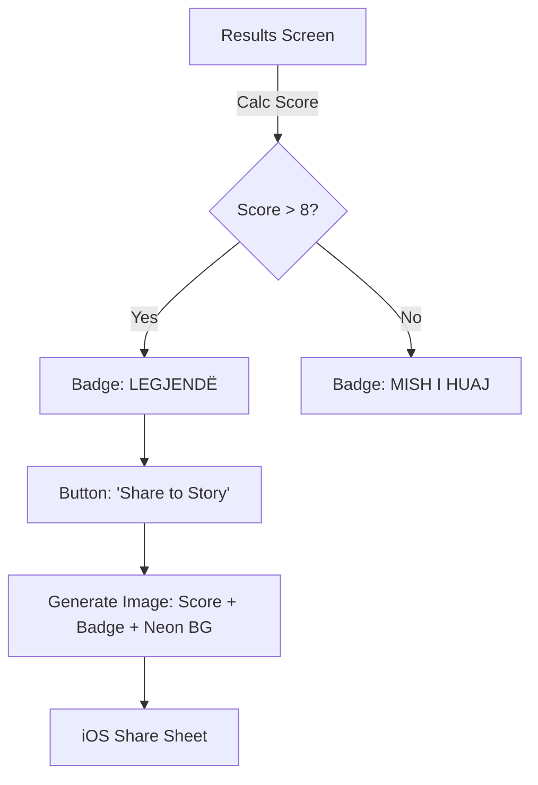

# UX Design Specification Kape

**Author:** Ardian
**Date:** 2026-01-09

---

## Executive Summary

### Project Vision
Kape! is a viral iOS party game that transforms the standard charades format into a culturally resonant experience for the Albanian diaspora. By leveraging "inside jokes," specific cultural validation (the "Gurbet" experience), and a high-fidelity native iOS implementation, it aims to replace generic party games with a product that feels "made for us." The core experience is built on "Instant Fun" - zero friction, immediate gameplay, and a viral loop driven by status signaling ("Legjendë").

### Target Users
*   **The Bridge Builder (Ardi):** Young, bilingual diaspora members acting as cultural connectors. They value the "vibe" and "status" needed to be the life of the party.
*   **The Cultural Learner (Lisa):** Non-Albanian friends/partners using the game as a low-pressure entry point into the culture.
*   **The Traditionalist (Aunt Shpresa):** Older generation users who need extreme accessibility (large text, simple gestures) and immediate "it just works" usability.

### Key Design Challenges
*   **The "Party Proof" Interface:** Designing for chaotic, loud, low-light environments (clubs, living rooms) where attention is split. Controls must be error-tolerant (debounce logic) and feedback must be multi-sensory (haptics + audio).
*   **Cross-Generational Usability:** Balancing a "Cool/Neon" Gen-Z aesthetic with the legibility and simplicity required for older players who might not be tech-savvy.
*   **Motion Interpretation:** Communicating the "Tilt" mechanic intuitively without long tutorials, ensuring the user understands the "Forehead" placement vs. "Reading" state.

### Design Opportunities
*   **Bone Conduction Haptics:** Utilizing the phone's contact with the forehead to create a unique, immersive tactile feedback loop that web apps can't match.
*   **Status-Driven Viral Assets:** Designing the result screens not just as data, but as "Badges of Honor" (e.g., the Double-Headed Eagle icon) that users *want* to post on Instagram.
*   **The "Vibe Shift" UI:** Using micro-animations and "Neon" aesthetics to visually represent the energy of the party, making the app feel alive and premium ("The Rolex of Party Games").

## Core User Experience

### Defining Experience
The core Kape! experience is a high-energy, 60-second social burst. The user (Guesser) becomes the center of attention, using the phone as a physical prop on their forehead to elicit clues from the group (Givers). The experience is defined by the **"Loop of Laughter"**: Clue -> Recognition -> Tilt -> Reward (Haptic/Audio) -> Next.

### Platform Strategy
*   **Device:** iPhone (Held physically against forehead).
*   **Input:** Motion (CoreMotion) is the primary input; Touch is secondary (menu only).
*   **Output:** Audio and Haptics are primary for the Guesser; Visuals are for the Audience.
*   **Context:** Offline-first, reliable in low-network party basements.

### Effortless Interactions
*   **Smart Debounce:** The system ignores "laughter shakes" and only registers deliberate nods/tilts.
*   **Instant Restart:** "Play Again" is the biggest button on the result screen.
*   **Ambient Safety:** The app respects the hardware mute switch but prioritizes Haptics so the game is playable even in loud clubs.

### Critical Success Moments
*   **The Mechanics Trust:** The user trusts that the phone "felt" their nod. If this fails once, the game is broken.
*   **The Cultural Payoff:** When a specific term (e.g., "Tavë Kosi") triggers an uproar in the room.
*   **The Status Signal:** Seeing the "Legjendë" rank on the results screen.

### Experience Principles
1.  **Blind Confidence:** The interface must communicate state (Correct/Pass/Time Up) effectively to a user who cannot see the screen.
2.  **Party Speed:** Transitions must be instant. Animation should be snappy, not cinematic.
3.  **Social First:** The UI encourages looking at friends, not the phone.
4.  **Forgiving Design:** It's hard to be precise while laughing; the UI must forgive sloppy gestures.

## Desired Emotional Response

### Primary Emotional Goals
*   **Euphoria (The High):** The core loop is designed to generate rapid-fire dopamine hits through immediate feedback (Sound + Haptic) and social validation (Laughter).
*   **Belonging (The Bond):** The content and aesthetic act as a "cultural mirror," making the user feel seen and understood by the product.
*   **Status (The Flex):** The result screen isn't just a score; it's a social tool to prove dominance within the friend group.

### Emotional Journey Mapping
1.  **Onboarding:** *Surprise & Delight.* "Wow, it's already ready to play? No login?"
2.  **The Countdown:** *Anticipation/Tension.* "Place on forehead..." -> Heart rate rises.
3.  **The Gameplay:** *Flow State.* Losing track of time/surroundings, fully immersed in the interaction with friends.
4.  **The Result:** *Validation.* Seeing the rank "Legjendë" confirms their social status.

### Micro-Emotions
*   **"Gotcha!":** The feeling when a complex motion gesture is interpreted correctly by the system.
*   **"Inside Joke":** The smirk when seeing a card like "Pite" or "Golf 4".
*   **"Just One More":** The addictive urge triggered by the "Play Again" button prominence.

### Design Implications
*   **Aggressive Feedback:** Subtle animations don't work for euphoria. We need screen shakes, heavy haptics, and bold colors.
*   **Cultural Microcopy:** Error messages and buttons shouldn't be standard iOS system text. They should have "attitude" (e.g., instead of "Retry", say "Hajde Prap").
*   **Speed over Smoothness:** Animations should be punchy (bouncy springs) rather than slow/elegant linear fades.

### Emotional Design Principles
1.  **Amplify the Win:** The victory moment (correct guess) must be the loudest part of the interface.
2.  **Culture is UI:** The language and visual metaphors aren't just "content"; they are the interface.
3.  **Don't Kill the Vibe:** Errors must be handled seamlessly without stopping the flow (e.g., auto-skip if motion detection is weird).

## UX Pattern Analysis & Inspiration

### Inspiring Products Analysis
*   **Heads Up!:** *The Anchor.* Solves the "Party Lull" problem but feels generic. Good motion, bad vibe.
*   **TikTok:** *The energy.* The gold standard for "Instant Endorphins." The UI disappears; the content is everything.
*   **Duolingo:** *The Hook.* Masters the art of "Juicy" UI feedback (sound + animation) for small wins.
*   **Spotify Wrapped:** *The Flex.* Converts personal data into a highly shareable social identity asset.

### Transferable UX Patterns
*   **The "Juicy" Transition (Duolingo):** Correct guesses shouldn't just distinctively increment a number; they should explode with particles/haptics.
*   **The "Wrapped" Share (Spotify):** Result screens use high-contrast typography and generated imagery (not just screenshots) to make the user look cool.
*   **The "Infinite Loop" (TikTok):** "Play Again" is the default highly-prominent state, but a secondary "Exit" path ensures user control.

### Anti-Patterns to Avoid
*   **"Tutorial Fatigue":** Do not force users to watch a "How to Play" video. Use a simple, native animation on the "Place on Forehead" screen.
*   **"System Default Alerts":** Never use standard iOS alerts for gameplay events (e.g., "Time's Up"). It breaks immersion.
*   **"Account Wall":** The first game must be playable within seconds of download.

### Design Inspiration Strategy
1.  **Imitate the Physics (Heads Up!):** Don't change the tilt angle thresholds; users' muscle memory is already trained.
2.  **Steal the Vibe (TikTok):** Use full-screen, immersive layouts. No navigation bars during gameplay.
3.  **Gamify the Culture (Duolingo):** Use "Levels" (e.g., "Shqipe", "Bishë", "Legjendë") instead of 1-5 stars.
4.  **Native Implementation:** Use native SwiftUI animations with SF Symbols (rotating phone icon) instead of Lottie to keep the app lightweight and dependency-free.

## Design System Foundation

### 1.1 Design System Choice
**Custom Native "Vibe" System (SwiftUI implementation of Atomic Design)**.
We will not use a third-party UI library. We will build a small, focused set of reusable SwiftUI views that implement our specific high-contrast, neon aesthetic.

### Rationale for Selection
*   **Performance:** Third-party libraries add bloat and risk dropping frames during motion gameplay. Native SwiftUI views are optimized by Apple.
*   **Brand Necessity:** A party game relies on immersion. Standard iOS sheets and alerts (white rounded rectangles) break the "Dark Mode Club" atmosphere.
*   **Maintenance:** No external dependencies means no breakage when iOS 18/19 drops.

### Implementation Approach
*   **Tokens First:** Define `Color+DesignSystem.swift` and `Font+DesignSystem.swift` extension files immediately.
*   **Atomic Components:**
    *   `KapeButton`: A high-contrast button that includes Haptic feedback *on press* by default.
    *   `GameCard`: The central playing element, handling tilt animations.
    *   `VibeBackground`: A dynamic background view (gradients/particles) that persists across screens.

### Customization Strategy
*   **The "Neon" Shadow:** All interactive elements will use a specific spread-shadow technique to simulate neon glow.
*   **Typography Scale:** We will define a custom `monitor` style scale (Huge/Bold) for legible gameplay text (e.g., 80pt font for the card word).

## 2. Core User Experience

### 2.1 Defining Experience
**The Blind Tilt.** The user controls the interface entirely through neck position while unable to see the screen. This effectively turns the user's head into a joystick and the phone into a blind-feedback device.

### 2.2 User Mental Model
*   **The "Heads Up" Standard:** Users are pre-trained on "Tilt Down = Correct" and "Tilt Up = Pass." Deviating from this (e.g., using tap gestures) would cause massive friction.
*   **The Physical Prop:** Users treat the phone as a card stuck to their head. They often hold it with two hands for stability while laughing.

### 2.3 Success Criteria
*   **Laughter Filtering:** The accelerometer must distinguish between "nodding" (controlled rotation) and "laughing" (chaotic shaking).
*   **Audio/Haptic Synesthesia:** The sound and vibration must happen in the exact same millisecond to create a convincing physical "clunk" sensation.

### 2.4 Novel UX Patterns
*   **Haptic "Bone Conduction":** We treat the Taptic Engine not just as a notification request, but as a texture generator. A "Correct" guess feels like a heavy thud against the skull; a "Pass" feels like a sliding whisk.
*   **Audience-First UI:** The screen is primarily for the *audience*, not the player. Text must be maximized (auto-scaling) to be legible from 2 meters away.

### 2.5 Experience Mechanics
1.  **Buffer State:** User places phone on forehead. Gyro detects `y-axis > 0.8`. Screen shows "Ready..."
2.  **Trigger:** User nods (Pitch changes > 35°).
3.  **Debounce:** System locks input for 500ms preventing double-skips.
4.  **Resolution:** Card animates off-screen (Up/Down direction matches head movement). Background flashes color (Green/Red).

## Visual Design Foundation

### Color System
*   **Theme Name:** "Electric Eagle" (High Contrast Dark Mode)
*   **Palette:**
    *   `Background`: #000000 (True Black)
    *   `Brand Primary`: #FF3B30 (Electric Red)
    *   `Game Success`: #39FF14 (Neon Green)
    *   `Game Pass`: #FF9500 (Neon Orange)
    *   `Text Primary`: #FFFFFF (White)
    *   `Text Secondary`: #EBEBF5 (iOS System Gray 6)

### Typography System
*   **Family:** SF Pro Rounded (Native)
*   **Styles:**
    *   `Display`: Weight: .heavy, Size: 80pt (Dynamic Type: AccessibilityXXXL supported) - *Used for Game Cards*
    *   `Heading`: Weight: .heavy, Size: 34pt - *Used for Result Screens*
    *   `Button`: Weight: .bold, Size: 20pt - *Used for Primary Actions*

### Spacing & Layout Foundation
*   **Grid:** 8pt Base Grid.
*   **Touch Targets:** Minimum 60pt height (Party-safe sizing).
*   **Edge Insets:** Aggressive safe-area insets (min 24pt) to prevent accidental touches while holding the device.
*   **Density:** Low density. One primary action per screen.

### Accessibility Considerations
*   **Reduced Motion:** The app will check `UIAccessibility.isReduceMotionEnabled` to replace screen shakes with simple fades.
*   **Dynamic Type:** All text elements, including the huge Game Card text, must scale with system font settings (using `ViewThatFits` in SwiftUI).

## Design Direction Decision

### Design Directions Explored
We explored three variations of the "Electric Eagle" theme:
1.  **The Clean Cut (Minimalist):** High function, zero noise.
2.  **The Tirana Night (Cyberpunk):** High vibe, Radial Gradients, Neon shadows.
3.  **The Hype Beast (Brutalist):** Rotated text, sticker aesthetics.

### Chosen Direction
**Winner:** Modified "Tirana Night".
We are choosing the **Cyberpunk Glow (Option 2)** but injecting the **Legibility of Option 1**.

### Design Rationale
*   **Vibe:** The Radial Gradient + Neon Box Shadows perfectly match the "Club" context and premium feel Ardi expects.
*   **Accessibility:** We rejected the "Hype Beast" rotation/stickers because Aunt Shpresa needs to read the card in <0.5s. We rejected the blurry neon text of Cyberpunk in favor of clean White-on-Black text from the Minimalist option.
*   **Dev Efficiency:** This style is trivial to implement in native SwiftUI (`.shadow`, `RadialGradient`), requiring no assets or complex canvas drawing.

### Implementation Approach
*   **Visual Logic:**
    *   **Background:** True Black (`#000000`) with a central active `RadialGradient` (Red/Green/Orange depending on state) fading to black edges.
    *   **Text:** Pure White (`#FFFFFF`) with NO shadow/blur for maximum sharpness.
    *   **Neon Effect:** Applied ONLY to containers (Buttons, Card Borders) using `shadow(color: .red, radius: 20)`.

## User Journey Flows

### 1. The "Instant Party" Flow (First Launch)
**Goal:** Minimizing Time-to-Laughter. Validating the "Tilt" mechanic implicitly.

```mermaid
graph TD
    A[App Launch] -->|No Account Needed| B[Landing Screen "KAPE!"]
    B -->|Large 'Start' Button| C{First Time?}
    C -->|Yes| D[Permission Request: Motion & Fitness]
    D --> E[Interactive Tutorial: 'Tilt to Start']
    E -->|User Tilts Down| F[Haptic Success Thud]
    F --> G[Game Starts Immediately]
    C -->|No| H[Deck Selection Screen]
    H -->|Quick Play| G
```

### 2. The "Hot Seat" Loop (Gameplay)
**Goal:** Managing the 60-second chaos with blind controls.

```mermaid
graph TD
    Start[Countdown 3..2..1] -->|Haptic Tick| GameLoop
    state GameLoop {
        direction TB
        Ready[Phone on Forehead] -->|Tilt Down| Correct[Success: Green Flash + Heavy Haptic]
        Ready -->|Tilt Up| Pass[Pass: Orange Flash + Light Haptic]
        Correct --> NextCard
        Pass --> NextCard
    }
    GameLoop -->|Timer Ends| Finish[Time's Up Alarm]
    Finish --> Result[Results Screen]
```

### 3. The "Flex" Flow (Results & Sharing)
**Goal:** Converting game data into social status.



### Journey Patterns
*   **The "Tilt-to-Confirm":** Using the core mechanic even for menu actions (e.g., "Tilt to Start").
*   **The "One-Tap Loop":** The "Play Again" button is always the primary action, skipping all setup screens.

### Flow Optimization Principles
*   **Permission Priming:** We only ask for **Motion & Fitness** permissions. Video recording is deferred to V1.1, so no Camera permission is needed for launch, significantly lowering friction.
*   **Error Recovery:** If the gyroscope reads weird data (e.g., user is jumping), we pause the input for 0.5s rather than throwing an error alert.

## Component Strategy

### Design System Components
We are leaning on native SwiftUI atoms for basics but wrapping them:
*   `Text` -> Wrapped in custom `VibeText` modifiers.
*   `Image` -> Used raw for SF Symbols.
*   `VStack/HStack` -> Standard layout usage.

### Custom Components
#### `KapeCard`
*   **Purpose:** The central focus of the "Forehead" experience.
*   **States:** `Idle` (White/Black), `Success` (Green), `Pass` (Orange).
*   **Animation:** 3D Flip transition when state changes.
*   **Accessibility:** Dynamic Type supported (text shrinks if word is long).

#### `NeonButton`
*   **Purpose:** Primary call-to-action (Start, Next, Share).
*   **Anatomy:** Bold Text + RoundedRect + Colored Shadow + Haptic Trigger.
*   **Interaction:** Scale down on press (0.95x).

#### `RankBadge` (Phase 1 Priority)
*   **Purpose:** Displays "Legjendë" or "Mish i Huaj" as a viral/shareable sticker.
*   **Style:** Brutalist, rotated text, bold border. Needs to look "stamped" on.
*   **Importance:** Critical for the Shareable Image (Instagram Story) to drive the viral loop.

#### `TiltTutorialView`
*   **Purpose:** Implicitly teaches the physical mechanic.
*   **Content:** SF Symbol `arrow.turn.down.right` + `iphone` icon.
*   **Behavior:** Rotates in sync with the user's actual device gyroscope to show "alignment".

### Implementation Strategy
*   **Modifier-First:** We will create ViewModifiers for styles (e.g., `.neonGlow(color: .red)`) rather than making a rigid `NeonView` wrapper. This provides maximum flexibility to apply the "Tirana Night" vibe to any view (text, shapes, images) without code duplication.
*   **Haptic Integration:** Haptics are not a "side effect"; they are part of the component's `body` (using `.sensoryFeedback` modifiers in SwiftUI).

### Implementation Roadmap
1.  **Core Anatomy & Viral Assets:** Build `Color+extensions`, `Font+extensions` and the critical `RankBadge` immediately.
2.  **The Card:** Build `KapeCard` and test rotation performance.
3.  **The Inputs:** Build `NeonButton` and the MotionManager logic.
4.  **The Polish:** Add the `VibeBackground` wrapper last.

## UX Consistency Patterns

### Feedback Patterns
The "Party Proof" feedback loop requires multi-sensory confirmation for every action.
*   **Correct Guess:**
    *   **Visual:** Screen fades to Green (`#39FF14`) for 0.3s then back to Black.
    *   **Haptic:** `.impact(.heavy)` (Thud).
    *   **Audio:** "Ping" sound (Positive).
*   **Pass:**
    *   **Visual:** Screen fades to Orange (`#FF9500`) for 0.3s.
    *   **Haptic:** `.impact(.rigid)` (Texture).
    *   **Audio:** "Whoosh" sound (Neutral).

### Navigation Patterns
*   **No Tab Bar:** The app is a single Flow, not a utility.
*   **Sheet Architecture:** All non-gameplay screens (Settings, Store, History) appear as `.sheet` overlays. This maintains the "Game" context underneath.
*   **Action-Driven Navigation:** The "Back" button is often hidden; instead, we use a "Done" or "Play" action to dismiss settings.

### Button Hierarchy
*   **The "Party Button" (Primary):**
    *   **Usage:** Start Game, Next Round, Share.
    *   **Spec:** Full width (minus padding), 60pt height, Neon Shadow.
*   **The "Utility Button" (Secondary):**
    *   **Usage:** Settings, Deck Info.
    *   **Spec:** Circle Icon Button (44pt), semi-transparent background (`.ultraThinMaterial`).

### Interaction Rules
*   **Long-Press for Safety:** Critical destructive actions (like "Quit Game" mid-round) require a 1-second long press to trigger. This prevents accidental taps when passing the phone.
*   **Swipe-to-Dismiss:** All tutorial/result cards can be swiped away to return to the loop instantly.

## Responsive Design & Accessibility

### Responsive Strategy
*   **Orientation:** Locked to Landscape Mode. This ensures maximum surface area for clues and aligns with PRD/Architecture mandates.
*   **Device Support:** iPhone only. iPad support disabled for V1 (Safety/Ergonomics).
*   **Layout Logic:**
    *   Vertical spacing is `Spacer(minLength: 20)` rather than fixed pixels to adapt to taller screens (iPhone 16 Pro Max).
    *   Safe Area Insets are aggressively respected to avoid "Notch" interference with the huge card text.

### Accessibility Strategy
*   **Visual:**
    *   **Contrast:** White text on Black background (21:1 ratio) far exceeds WCAG AAA.
    *   **Text Sizing:** `KapeCard` wraps text to multiple lines if Font Size > 80pt.
*   **Sensory:**
    *   **Haptic Fallback:** Crucial. If a user has Haptics disabled, we play a louder Sound. If Sound is muted, we flash the screen brighter.
*   **Motor:**
    *   **No "Pinches":** All gestures are gross motor movements (Tilt head) or simple taps. No complex multi-finger gestures.

### Implementation Guidelines
*   **Font Scaling:** Use `.minimumScaleFactor(0.5)` on the Game Card text to prevent truncation.
*   **Motion Capability:** Wrap the rotation animation in `if !accessibilityReduceMotion`.
*   **Haptic Engine:** Check `CHHapticEngine.capabilitiesForHardware()` to ensure we don't crash on older devices (iPhone 7/8 support).

<!-- UX design content will be appended sequentially through collaborative workflow steps -->

## Tournament Mode UX (Epic 6)

### 3.1 Tournament Entry & Setup
**Goal:** Mitigate the "Setup Friction" of entering names in Landscape Mode.
*   **Entry Point:** A new "Turne" (Tournament) button below "Start Game" on the main menu. Distinct visual style (Gold/Premium?) to differentiate from Quick Play.
*   **Keyboard Pain:** Typing in Landscape on iOS is intrusive and covers the UI.
    *   **Solution:** Use a modal sheet. Keep fields high up to avoid keyboard covering them.
    *   **Defaults:** Auto-fill "Lojtari 1", "Lojtari 2" so users can skip typing if lazy.

### 3.2 The "Pass Device" Interstitial
**Goal:** Manage the physical hand-off of the device without accidental triggers.
*   **State:** A "Blocking" screen between rounds.
*   **Visuals:** High-contrast "Pause" aesthetic (e.g., striped background or pulsing "Waiting").
*   **Action:** A massive "Gati!" (Ready) button that requires a deliberate tap. This prevents the gyroscope from triggering "Correct/Pass" while the phone is being passed hand-to-hand and ensures the new player is settled.

### 3.3 The Tournament Leaderboard
**Goal:** The ultimate "Social Proof" moment.
*   **Visual Hierarchy:**
    *   **#1 (Legjendë):** Gold, pulsing, confetti animation.
    *   **#2-#3:** Silver/Bronze styling.
    *   **#4-5:** Grayed out ("Turist").
*   **Action:** "Share Podium" button generates a multi-name image for Instagram Stories.
